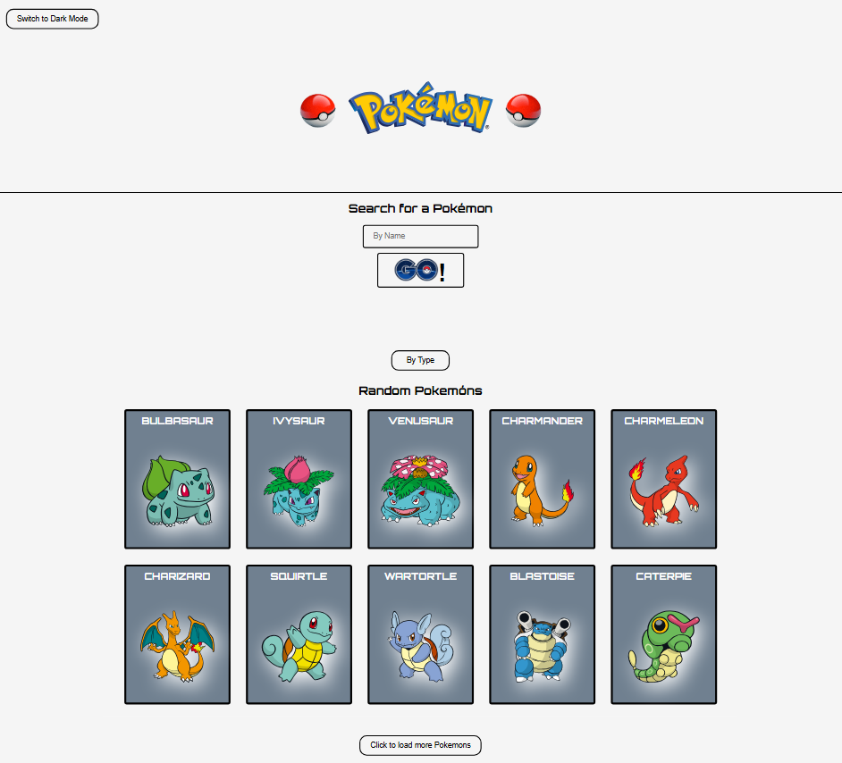
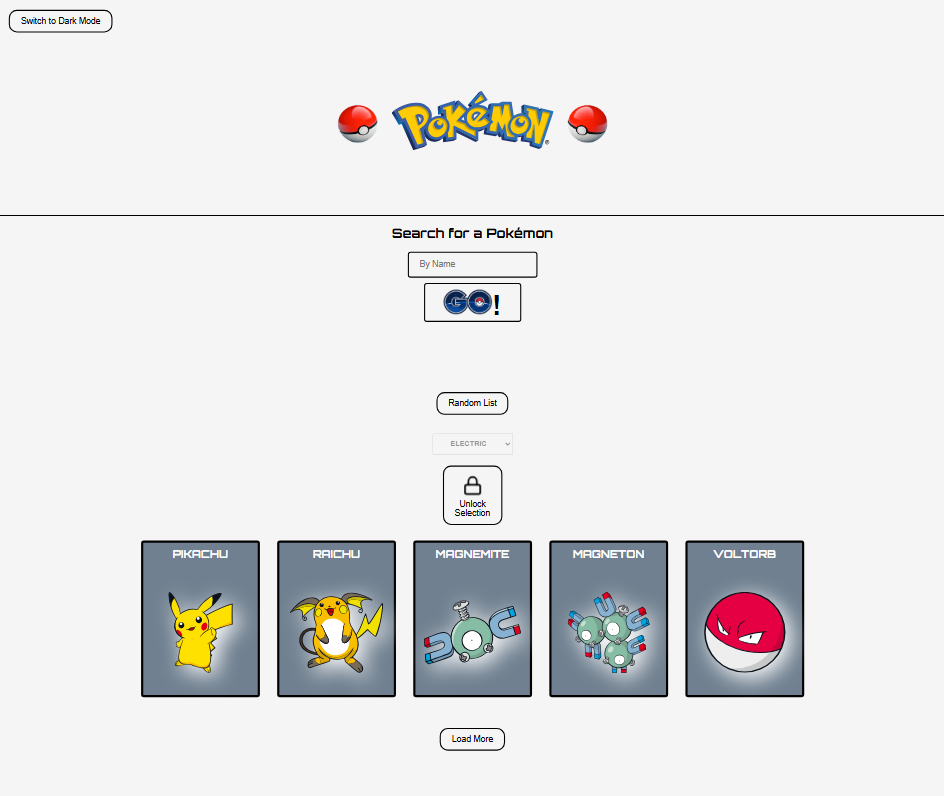
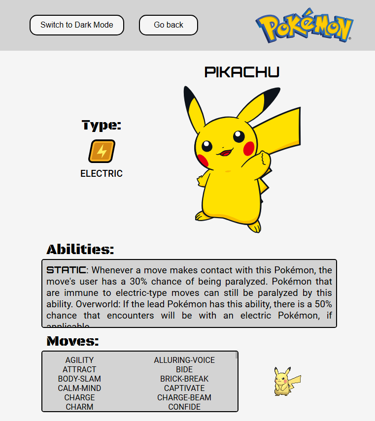
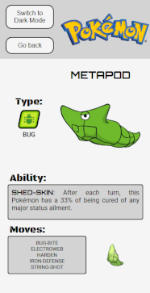
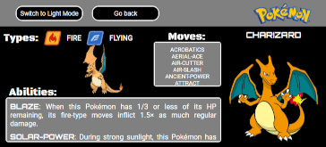

# DevQuest - Desafio PokeAPI 

## Pokémon Cards App

$\hspace{15pt}$ Esta aplicação foi desenvolvida para que através da API PokeAPI apresentar aos usuários listas de Pokémons, nas
quais é possível através de um clique em algum Pokémon apresentado na tela em formato de Cartão, obter acesso
às informações sobre o respectivo Pokémon em uma outra página interna. Seus Tipo(s), Habilidade(s) e Movimentos.

$\hspace{15pt}$ A lista inicial "Pokémons Aleatórios" contém 10 cards, logo abaixo da lista há um botão, que a cada
clique acresenta mais 10 à lista inicial.
    
$\hspace{15pt}$ Nesta mesma página há um campo de input onde é possível obter acesso ao card do pokémon através apenas do nome. Para
tornar possível esse objetivo, limitei a possibilidade de inserir números, símbolos, espaços em branco ' ', gerando
um alerta para cada possível "erro" no campo e uma mensagem em vermelho, foram permitidas as excessões encontradas,
nomes nos quais há números e "-" em sua composição.

$\hspace{15pt}$ Há a opção de filtrar por seleção de tipo, em listas de Pokémons pelo tipo, onde também há um botão para carregar
mais itens até atingir o limite de Pokémons encontrados de acordo com a seleção. 

$\hspace{15pt}$ Ao mover o cursor sobre os cards, há o efeito de mudança de cor, e apresenta a mensagem "Click for details".
Funcionalidade não implementada na versão mobile.

$\hspace{15pt}$ Na página de detalhes, o usuário pode retornar à página inicial clicando no botão "Go back", outra maneira de
retornar à pagina principal é clicando na Logo do Pokémon na barra do menu. E também pode-se alternar entre os
temas "Light/Dark".

$\hspace{15pt}$ Por padrão preferi utilizar o Inglês como idioma do app. 

## Pontos de ajustes:

$\hspace{15pt}$ Botão de "scroll up" - em formato de seta pra cima - para retornar ao topo da página, condicionado ao tamanho atual
da página, após incrementar as listas de Pokémons Aleatórios e por tipo o botão é inserido na página, tornando-se um atalho
mais fácil retornar ao início da página.

$\hspace{15pt}$ Botão para alternar entre os temas "Light" (Claro) e "Dark" (Escuro), opção para alternar as propriedades dos componentes
por temas.
    
$\hspace{15pt}$ Ao iniciar a implementação do app me deparei com algumas situações nas quais me desafiei a minimizar possíveis erros/falhas
no retorno das informações acessadas na API, exemplos: Pokémons sem imagem de retorno, busquei caminhos para imagens
alternativas, e criei imagens padrão onde este dado não era disponibilizado.

$\hspace{15pt}$ Aviso de "Loading" ao clicar em botões que realizam solicitações à API. Forma encontrada de previnir possíveis erros na lista
de Pokémons por Tipo, ao carregar mais Pokémons.

$\hspace{15pt}$ Ao alternar entre as opções por tipo do campo "Select" eram apresentadas falhas nas listas, divergencias nas quantidades de
Pokémons nos resultados finais, a solução encrontrada foi a inserção de um botão com um ícone animado de um cadeado, que ao 
realizar a seleção o campo "Select" fica inativo, ativando o botão "Unlock Selection" que permitirá liberar a alteração do 
campo "Select". Ao chegar ao final da lista por Tipo, é apresentada uma mensagem com a quantidade e o tipo de Pokémons na
lista apresentada.

$\hspace{15pt}$ Inseri algumas imagens ao projeto que não são diretamente da API, referentes aos tipos de Pokémons.

$\hspace{15pt}$ Na tela de detalhes do Pokémon, ao realizar testes, constatei que existem Pokémons com apenas uma habilidade, sem movimentos
listados, e de apenas um tipo. Realizei as adequações para apresentar as informações de forma coerente.

$\hspace{15pt}$ Outra possível falha encontrada durante o processo, a lista de habilidades retornavam dados em duplicidade, inseri um filtro
para trazer habilidades únicas, realizando a comparação pelo nome da habilidade, e a descrição da habilidade aparecia de forma
intercalada entre idiomas diferentes, alemão, inglês, italiano, etc, não seguindo um padrão. Realizei o filtro, puxando somente
no idioma Inglês, buscando padronizar as informações.

$\hspace{15pt}$ A aplicação desenvolvida é compatível com dispositivos móveis.

$\hspace{15pt}$ Estilização realizada com o styled-components, o react-router para as rotas e o API Context para para a criação de um Theme
Toggle (alternar entre tema claro e escuro).

# Telas

## Desktop

### HomePage

### By Type List

### Details Page

## Mobile 

 

    
### Detail Page (Portrait Orientation) Light Theme
 

    
### Detail Page (Landscape Orientation) Dark Theme

## Clipe 

    
https://github.com/user-attachments/assets/5feb012c-3853-49d7-bfff-c0e3aad42da5

## Ferramentas utilizadas
- React.js: utilizado para criar componentes e a interface do usuário, deixando o código mais limpo e sem o código se tornar muito repetitivo.
- Single Page Application (SPA), Página com estrutura SPA, tornando as respostas de navegação mais rápidas e sem necessidade de recarregar a página.
- Context API utilizado para criação dos temas "Light" (claro) e "Dark" (escuro). Maneira eficaz para estilização dos componentes em alternância dos temas escolhidos pelo usuário através do clique.
- Styled-components: biblioteca para realizar as estilizações de forma mais direta e dinâmica sem a necessidade de um arquivo .css.
- React-router-dom utilizado para realizar as ligações dos caminhos do SPA, exemplo: troca entre a home page e a página interna.
- Projeto criado com VITE.

# Procedimentos para instalação e execução do app

Certifique-se de que o Node.js está instalado em seu computador.

Faça um clone do repositório e acesse o diretório.
Para clonar o repositório, abra um terminal no VsCode - teclas de atalho: **`ctrl+shift+'`** . 

Na linha de comandos digite:

    git clone https://github.com/MateusRissoDiBlasio/Pokemon.git

Acesse o diretório:

    cd Pokemon

Instalação das dependências:

    npm install

Executar a aplicação:

    npm run dev

Clique no link gerado pelo terminal.
